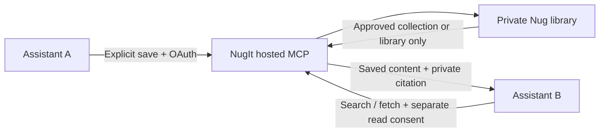

# Architecture

All documented packages connect directly to `https://nugit.ai/mcp` using Streamable HTTP. OAuth discovery, authorization, storage, tool execution, and access enforcement are provided by the hosted NugIt application. The local package does not intercept traffic, store tokens, or run a proxy.

`server.json` is registry metadata, not a runnable server. The Cursor and Claude Code manifests live at the repository root; the standalone Codex package is in `plugins/nugit`. Client-specific examples are intentionally separate because their configuration formats differ. Validation checks that they continue to point at the same service.

The public source license applies to these integration files. It does not provide the backend implementation or grant rights to third-party platform trademarks. The hosted service remains subject to its terms.

This repository's release version describes integration metadata and packaging. It need not equal the hosted server's MCP `serverInfo.version`. Keep the registry identity stable across public repository changes.
